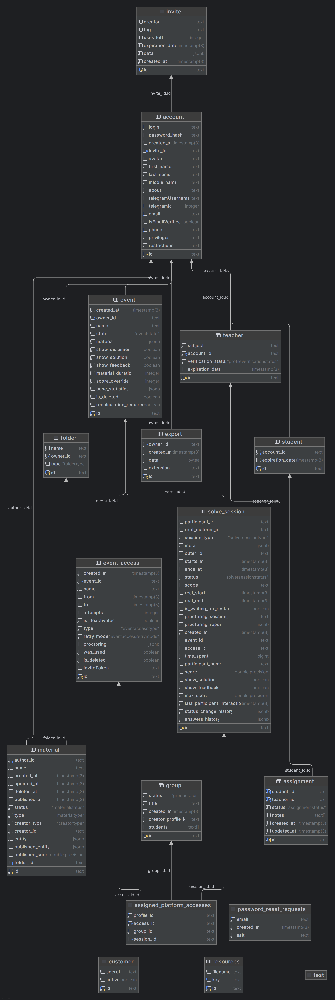

# Backend Documentation

## Технологический стек
-   **Framework**: NestJS
-   **Language**: TypeScript
-   **Database**: PostgreSQL
-   **ORM**: Prisma
-   **Documentation**: Swagger (OpenAPI)
-   **Logging/Monitoring**: Sentry, Winston
-   **Authentication**: JWT
-   **Validation**: class-validator, class-transformer

## Архитектура
Проект организован по модульному принципу. Все бизнес-модули находятся в директории `src/modules`.
Общие системные компоненты и утилиты находятся в `src/system` и `src/utils`.

### Слои архитектуры
1.  **api (Presentation Layer)**: Контроллеры, DTO. Отвечают за прием запросов и валидацию.
2.  **model (Domain Layer)**:
    -   **domain**: Сущности, агрегаты.
    -   **services**: Доменные сервисы, реализующие бизнес-логику (например, `AuthorizationService`, `AccountUpdateService`).
    -   **interfaces**: Интерфейсы репозиториев и внешних сервисов (Dependency Inversion).
3.  **infrastructure (Infrastructure Layer)**:
    -   **persistence**: Реализация репозиториев (Prisma).
    -   **services**: Адаптеры для взаимодействия с другими модулями или внешними системами (реализация интерфейсов из `model`).
4.  **services (Module Services)**:
    -   В некоторых модулях (например, `solver`, `materials`) здесь находятся сервисы, которые реализуют сложную логику или предоставляют API для других модулей (например, `OutputSolverServiceForMaterials`).

### Взаимодействие между модулями
Взаимодействие между модулями осуществляется **строго через интерфейсы**.

Паттерн взаимодействия:
1.  Модуль-потребитель (например, `Events`) определяет интерфейс требуемого сервиса (например, `IAccountsService`) в своем слое `model`.
2.  В слое `infrastructure` модуля-потребителя реализуется адаптер (например, `NativeAccountsService`), который имплементирует этот интерфейс.
3.  Адаптер использует конкретный сервис из модуля-поставщика (например, `AccountsService`).
4.  В `module` файле происходит связывание интерфейса и реализации.

## Документация модулей

-   [Account](src/modules/account/README.md)
-   [Assignments](src/modules/assignments/README.md)
-   [Customer](src/modules/customer/README.md)
-   [Events](src/modules/events/README.md)
-   [Export](src/modules/export/README.md)
-   [Folders](src/modules/folders/README.md)
-   [Groups](src/modules/groups/README.md)
-   [Health Check](src/modules/health-check/README.md)
-   [Invites](src/modules/invites/README.md)
-   [Materials](src/modules/materials/README.md)
-   [Resources](src/modules/resources/README.md)
-   [SMTP](src/modules/smtp/README.md)
-   [Solver](src/modules/solver/README.md)
    -   [Locators](src/modules/solver/model/domain/locators/README.md)
    -   [Solvers](src/modules/solver/model/domain/solvers/README.md)

## Переменные окружения (Environment Variables)
-   `PORT`: Порт, на котором запускается сервер внутри контейнера.
-   `IS_DEV`: Режим разработки (`true`/`false`). Влияет на вывод ошибок и логирование.
-   `FRONTEND_URL`: URL фронтенда. Используется для настройки CORS и генерации ссылок в письмах.
-   `BACKEND_URL`: Публичный домен бэкенда (например, `api.example.com`). Используется для генерации абсолютных ссылок.
-   `BACKEND_PROTOCOL`: Протокол бэкенда (`http` или `https`). Используется для формирования полных URL.
-   `DATABASE_URL`: Строка подключения к PostgreSQL.
-   `JWT_SECRET`: Секретный ключ для подписи JWT токенов.
-   `EMAIL_VERIFICATION_SALT`: Соль для генерации токенов верификации email.
-   `BOT_REQUEST_SALT`: Секрет для запросов от ботов.
-   `GOOGLE_CLIENT_ID`: ID клиента Google OAuth.
-   `VKCOM_CLIENT_ID`, `VKCOM_CLIENT_SECRET`: VK OAuth.
-   `MAILRU_CLIENT_ID`, `MAILRU_CLIENT_SECRET`: Mail.ru OAuth.
-   `MAILER_URL`, `MAILER_API_KEY`: Настройки сервиса рассылок (Unisender).
-   `YANDEX_SMTP_URL`, `YANDEX_SMTP_PORT`, `YANDEX_SMTP_LOGIN`, `YANDEX_SMTP_PASSWORD`: Настройки SMTP.
-   `DISABLE_MAILING`: Отключить отправку писем (`true`/`false`).
-   `YANDEX_S3_URL`, `YANDEX_S3_ACCESS_KEY`, `YANDEX_S3_SECRET_KEY`: Настройки S3 совместимого хранилища.
-   `YANDEX_S3_PRIVATE_BUCKET_NAME`: Бакет для приватных файлов.
-   `YANDEX_S3_PUBLIC_BUCKET_NAME`: Бакет для публичных файлов.
-   `PRIVATE_RESOURCES_FILE_SIZE_LIMIT`: Лимит размера приватных файлов (в байтах).
-   `PUBLIC_RESOURCES_FILE_SIZE_LIMIT`: Лимит размера публичных файлов (в байтах).
-   `SENTRY_URL`: DSN для Sentry (мониторинг ошибок).
-   `BUILD_SWAGGER`: Генерировать ли Swagger документацию (`true`/`false`).
-   `PROCTORING_URL`, `PROCTORING_USER`, `PROCTORING_JWT_SIGN_SECRET`: Настройки интеграции с прокторингом.
-   `PROCTORING_REPORT_WEBHOOK_ENDPOINT`: Эндпоинт для вебхуков отчетов прокторинга.
-   `PROCTORING_SETUP_DEFAULT_TIME`: Время, даваемое на настройку прокторинга по умолчанию.
-   `DISABLE_REGISTRATION`: Отключить регистрацию новых пользователей (`true`/`false`).
-   `EVENT_TOKENS_SECRET`: Секрет для генерации токенов событий.

## Запуск проекта
прописать env переменные в [docker-compose.yml](../docker-compose.yml)
docker-compose up -d --build

## DB schema

